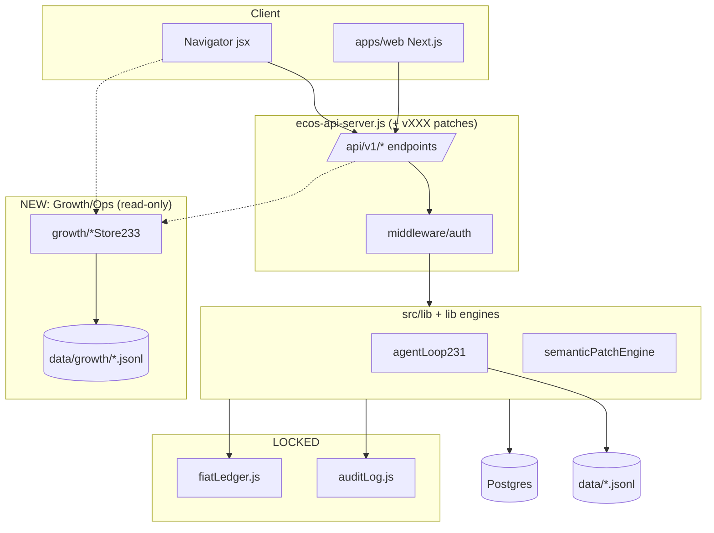

# ARCHITECTURE — ECOS (reconstructed)

```mermaid
flowchart TD
  subgraph Client
    NAV[Navigator jsx]
    WEB[apps/web Next.js]
  end
  subgraph API["ecos-api-server.js (+ vXXX patches)"]
    EP[/api/v1/* endpoints/]
    MW[middleware/auth]
  end
  subgraph Core["src/lib + lib engines"]
    AL[agentLoop231]
    SPE[semanticPatchEngine]
  end
  subgraph Sacred["LOCKED"]
    LEDG[fiatLedger.js]
    AUD[auditLog.js]
  end
  DB[(Postgres)]
  FEED[(data/*.jsonl)]
  NAV-->EP; WEB-->EP; EP-->MW-->Core
  Core-->LEDG; Core-->AUD; AL-->FEED; Core-->DB
  subgraph Growth["NEW: Growth/Ops (read-only)"]
    GS[growth/*Store233]
    GFEED[(data/growth/*.jsonl)]
  end
  GS-->GFEED; EP-.->GS; NAV-.->GS
```
שכבת Growth קוראת בלבד, אותו דפוס feed→store→endpoint→panel, בלי לגעת בקדושים.
